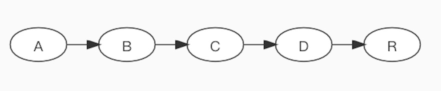
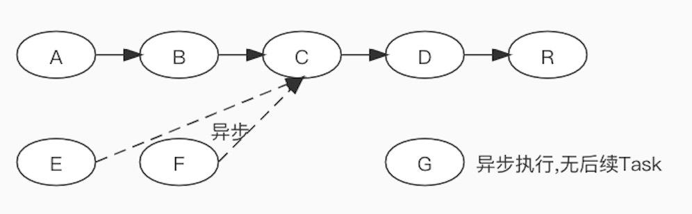
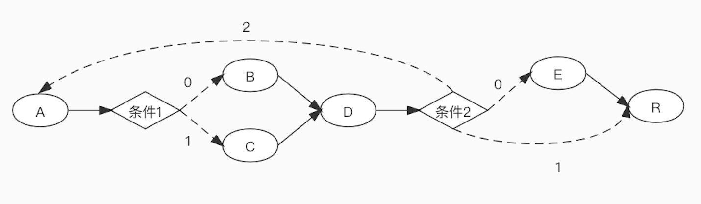

### 1.概述
以Athlizo的business-flow为蓝本修改而成的任务流框架.原项目地址:
- github:[https://github.com/Athlizo/business-flow-parent](https://github.com/Athlizo/business-flow-parent)

本项目增加了部分功能，支持SpringBoot，支持动态修改，支持异步执行等；并调整了原框架中的一些概念：
- Work：表示一项工作；由若干个任务组成，并维护各项任务执行时所需的上下文环境；根据执行方式分为下面两种：
  - Sequential Work：顺序工作；其任务按创建时的顺序依次执行；
  - RouteAble Work：可路由工作；任务根据条件决定执行顺序；
- Task：表示一项任务；其定义应该是一个无状态方法；
- Routing：路由；只有RouteAble Work才能定义Routing。决定当前Task执行完成后，指向下一个Task；若不指定或未匹配到任何Task则跳转到finish Task，执行完成后，整个Work执行完成，若未指定finish Task，则直接执行结束；

<table>
	<tr>
		<td rowspan="2">Sequential Work</td>
		<td>Synchronous</td>
		<td>
	</tr>
	<tr>
		<td>Asynchronous</td>
		<td></td>
	</tr>
	<tr>
		<td colspan="2">RouteAble Work</td>
		<td></td>
	</tr>
</table>

在执行任务中，任意同步Task抛出异常将中断Work的执行。推荐实现Work的dealExcpetion方法自定义异常的处理。已经在执行的异步Task不受异常影响，但尚未执行的异步Task将不再执行。

### 2.API介绍
#### 2.1 WorkContext接口
保存一个业务处理逻辑的上下文环境。

在Task中通过WorkContext来获取之前Task设置的数据，或设置当前Task的执行数据，传递给下一个Task；

改进后，支持设置额外的参数传递给特定Task或Routing，详见Usage；

#### 2.2 SequentialRouteWork类
Sequential Work的实现类。可直接使用，或进行扩展来自定义异常处理（dealExcpetion方法）和Task执行前置处理（receive方法；每个Task执行前会调用此方法）。

#### 2.3 CustomRouteWork类
RouteAble Work的实现类。在Task中调用其setRoutingKey方法来指定路由。

#### 2.4 Task接口
定义任务内容。只有一个方法void execute(Work work)。

除了实现Task接口来定义任务，也可以使用任意类来配置Task，此时需配置指定类的方法作为Task的执行方法。

#### 2.5 Routing接口
不支持扩展Routing接口；目前路由匹配模式只有两种：string（字符串匹配，默认）和regex（正则匹配）。 

### 3.Usage
#### 3.1 Task的定义
Task定义了要执行的内容。

推荐的方式是，将业务逻辑写在各种Service中，然后在Task中仅调用对应的若干Service，而不写任何业务逻辑代码。

定义的Task仅由taskflow框架调用；这样可以避免业务逻辑和taskflow框架耦合。
```
public class GetDiff implements Task {
    @Autowired
    private SomeBizService bizService;
    @Override
    public void execute(Work work) {
        int maxValue = work.getContext（"maxValue"）；
        int minValue = work.getContext（"minValue"）；
        //设置处理结果传递给下一个Task
        work.putContext（"effective"，bizService.isEffective(maxValue,minValue)）；
    }
}
```
或者
```
public class GetDiffTask {
    @Autowired
    private SomeBizService bizService;
    //方法名任意
    public void checkIfEffective(Work work) {
        int maxValue = work.getContext（"maxValue"）；
        int minValue = work.getContext（"minValue"）；
        //设置处理结果传递给下一个Task
        work.putContext（"effective"，bizService.isEffective(maxValue,minValue)）；
        //如果是RouteAble Work，可以指定Routing规则
        （（CustomRouteWork）work).setRoutingKey("some routing key");
    }
}
```
Task获取之前Task传入的参数，可以通过Work或者WorkContext获取，也可以直接将方法的参数名定义为与之前Task传入参数名一致。下面这个Task就获取了GetDiffTask.checkIfEffective所设置的值：
```
public class EndBizTask {
    //参数名在整个Work的所有Task中若不唯一，则需要在参数名上加@Taskparam("xxx")注解以区分
    public void end(String effective) {
        if("yes".equals(effective)){
           //invoke some service
        }
    }
}
```

#### 3.2 Task的配置
使用taskflow的标签来配置Task，其基于Spring。
```
<!--1.将定义Task的类配置为一个Spring管理的Bean-->
<bean id="getDiff" class="taskflow.examples.task.GetDiff"/>
或
<bean id="getDiffTask" class="taskflow.examples.task.GetDiffTask"/>

<!--2.配置Task-->
<tf:task id="step1" ref="getDiff"/>
或
<tf:task id="step11" ref="getDiffTask" method="checkIfEffective"/>

<!--2.1 RouteAble Work可以配置Routing-->
<tf:task id="step1" ref="getDiff">
   <tf:routing key="oneStop" toTask="target taskId1" patten="string"/>
   <tf:routing key="twoStop" toTask="target taskId2"/>
   <!-- 未匹配到routing则跳到finish定义的task，未配置finish则整个Work结束 -->
</tf:task>
```

#### 3.3 Work的配置
Sequential Work的定义，如下：
```
<tf:work id="sequentialTaskWork" traceable="true" maxTasks=100 class="taskflow.work.SequentialRouteWork">
  <tf:task-ref value="step1"/>
  <tf:task-ref value="step3"/>
  <tf:task-ref value="step2"/>
  <tf:task-ref value="step5"/>
  <tf:task-ref value="end"/>
</tf:work>
```
其中：
- id: 对应的一个Spring Bean的name
- traceable: 是否记录Task调用轨迹；true会记录执行每个task时的WorkContext内容快照
- maxTasks:规定了Work如果处理的次数大于这个数就会跑出异常（防止死循环）
- class:制定Work的类型;可自行扩展

RouteAble Work的定义，如下：
```
<tf:work id="routeAbleWork" start="start" finish="end" class="taskflow.work.CustomRouteWork"/>
```
其中:
- start: 起始Task；从指定Task开始执行；必填
- finish:最终Task；无论如何都会执行，即使执行过程中出现异常；选填

#### 3.4 Extra的配置
在开发中往往需要定义许多的Work，这些不同的Work可能会引用到同一个Task，在执行该Task时，不同的Work可能会需要不同的参数；

extra可以用来指定处于不同Work中的同一个Task的执行参数；extra的数据类型为String，建议定义为JSON，这样更灵活；定义方式如下：
~~~~
<tf:task id="step1" ref="getDiff" extra="{paramName:'paramValue'}">
   <tf:routing key="someKey" toTask="step2" extra="{paramName1:'paramValue1'}"/>
</tf:task>
...
<tf:task id="step2" ref="task2" extra="{paramName2:'paramValue2'}"/>
~~~~
上面定义的2个Task，若Work1引用了step2，此时step2的Task获得的extra为{paramName2:'paramValue2'}

而Work2引用step1执行完成后路由到step2时，此时step2的Task获得的extra为step1的routing中定义的{paramName1:'paramValue1'}

extra的获取：
~~~~
public class GetDiffTask {
    public void checkIfEffective(Work work) {
        String extra = work.getWorkContext().getRuntimeArgs()；
        ...
    }
    public void otherTaskMethod(WorkContext workContext) {
        String extra = workContext.getRuntimeArgs()；
        ...
    }
}
~~~~

### 4.Demo
现在有一个业务需求，需要做以下处理
1. 输入一个整型的list
2. 找出最大值和最小值
3. 如果最大值和最小值的差大于{x}输出“no”，否则输入“ok”
4. {x}通过配置extra指定

#### 4.1 XML方式
在classpath下新建配置文件task-config.xml

##### 第一步 编写Task类

编写相应的业务逻辑代码，详见test/demo

例如getDiff的核心代码如下：

```
private NumberService numberService;
public void getDiff(@Taskparam("maxValue") int a, @Taskparam("minValue") int b,WorkContext workContext) {
	int diff = workContext.getRuntimeArgsJSON().getInteger("threshold");
    if (numberService.checkNumber(a, b, diff)) {
        workContext.setRoutingKey("ok");
    } else {
        workContext.setRoutingKey("no");
    }
}
```

##### 第二步 定义Task

task-config.xml加入如下配置

```
<bean id="findNumberTaskBean" class="demo.task.FindNumber"/>

<tf:task id="findMaxTask" ref="findNumberTaskBean" method="findMax">
    <tf:routing toTask="findMinTask"/>
</tf:task>
<tf:task id="findMinTask" ref="findNumberTaskBean" method="findMin">
    <tf:routing toTask="getDiffTask"/>
</tf:task>
<tf:task id="getDiffTask" ref="findNumberTaskBean" method="getDiff" extra="{threshold:10}">
    <tf:routing key="ok" toTask="soutOutOkTask"/>
    <tf:routing key="no" toTask="soutOutNoTask"/>
</tf:task>
<tf:task id="soutOutOkTask" ref="findNumberTaskBean" method="soutOutOk"/>
<tf:task id="soutOutNoTask" ref="findNumberTaskBean" method="soutOutNo"/>
```
##### 第三步 定义Work

task-config.xml加入如下配置

```
<tf:work id="testWork" start="findMaxTask" class="taskflow.work.CustomRouteWork"/>
```

##### 第四步 运行

```
public class DemoApplication {
    public static void main(String[] args) {
        ClassPathXmlApplicationContext context = new ClassPathXmlApplicationContext("classpath:task-config.xml");

        Work testWork = WorkFactory.createWork("testWork");
        List<Integer> input = Arrays.asList(5, 7, 1, 0, 1, 3, 4, 5, 6, 4);
        testWork.putContext("intList", input);
        testWork.run();

        testWork = WorkFactory.createWork("testWork");
        input = Arrays.asList(52, 7, 1, -10, 1, 3, 4, 5, 6, 4);
        testWork.putContext("intList", input);
        testWork.run();
        
        context.close();
    }
}
```

#### 4.2 编程方式
编程式定义work/task时，taskflow框架不再跟spring耦合，所有要使用到的业务bean应该自行管理。

##### 第一步 定义Task
编写相应的业务逻辑代码，详见test/demo/WorkBuilderDemoApplication.java

示例代码如下：

```
Task findMaxTask = (workContext)->{
		List<Integer> input = workContext.get("intList");
		int maxValue = numberService.findMax(input);
		workContext.put("maxValue", maxValue);
};
@Autowired
FindNumber findNumber;
Task getDiffTask = (workContext) -> {
		int maxValue = workContext.get("maxValue");
		int minValue = workContext.get("minValue");
		findNumber.getDiff(maxValue, minValue, workContext);
};
```

##### 第二步 使用WorkBuilder创建Work

WorkBuilder可以创建RouteAbleWorkBuilder和SequentialWorkBuilder，分别用来生成顺序Work和可路由Work。

```
RouteAbleWorkBuilder workBuilder = WorkBuilder.newRouteableInstance();
//添加task后可立即为其添加routing，多个routing可连续调用多次putRouting()方法来添加
//定义routing时，若key和toTask都为空则routing无效，会被忽略
//routing可指向当前task以循环执行，最大次数受maxTasks的影响；见test/demo.WorkBuilderApplication示例
workBuilder.addTask(findMaxTask).putRouting(findMaxTask,RoutingBuilder.newInstance().toTask(findMinTask.getId()).build())
...
.addTask(findNumber::soutOutOk);
```

##### 第三步 运行work

```
Work work=workBuilder.build();
work.putContext("intList", Arrays.asList(5, 7, 1, 0, 1, 3, 4, 5, 6, 4));
String result = work.run().getResult();
```

### 5.异步Task
Sequential Work支持异步执行Task（RouteAble Work不支持，因为每一个Task是否执行由上一个Task决定）。
当Sequential Work中的某些Task跟其它Task没有依赖或执行顺序要求时，可以将该Task设置为异步方式执行，方式如下：

```
    <tf:work id="mySequentialTaskWork" traceable="true" class="demo.work.MySequentialWork">
        <tf:constructor-arg value="TestName"/>
	    	<tf:constructor-arg value="15" type="int" index="1"/>
	    	<!-- 将task-ref的async属性设置为true，则该Task将以异步方式执行 -->
	    	<tf:task-ref value="step1" async="true"/>
	    	<tf:task-ref value="step3" async="false"/>
	    	<tf:task-ref value="step2" async="true"/>
	    	<!-- async默认取值为false，所以同步Task可以不设置 -->
	    	<tf:task-ref value="step5"/>
	    	<tf:task-ref value="end"/>
    </tf:work>
```
开启异步Task时有几点需要注意：
##### 1）、Task执行顺序
Task在执行时依然按照定义的顺序调用，若为异步Task则触发调用后立即执行下一个Task。

比如有A、B、C三个Task，B为异步，A、C为同步，首先会调用A，等A执行完成后，才会触发调用异步执行B，然后再调用C，也即B和C是并行执行。

这样做是因为若异步Task所需的入参由同步Task传入，只需将异步Task放到同步Task之后即可。如若一个异步Task无任何依赖，可将其执行顺序放在最前面。

##### 2）、异步/同步Task间的参数传递
异步Task最好是可独立执行的，其入参不依赖其它异步Task传入（主要是多个异步Task可能会出现相互依赖参数的情况而形成死锁），但可依赖同步Task传入，如上1描述。

同步Task可以依赖异步Task传入参数。同步Task在执行时，若发现所需的入参不存在，而同时存在尚未执行的异步Task，则会挂起当前线程，等待所需参数设置后再继续往下执行。为防止依赖参数本就不存在或参数名写错，而导致执行同步Task的线程长时间挂起，可通过参数taskflow.task.asyncTimeOut来设置等待时间，单位为毫秒，默认30000。

##### 3）、线程池
可以自定义异步执行的线程池，只需要实现taskflow.config.bean.TaskExecutorFactory接口，并交由Spring管理即可。

如果未自定义线程池，系统会使用默认实现：taskflow.config.bean.DefaultTaskExecutorFactory，其corePoolSize=0，maximumPoolSize=4；

系统并不总是创建这个默认线程池，只有当发现work中有配置异步task时，才尝试查找/注册TaskExecutorFactory的实例。

### 6.参数详情
<table>
	<tr>
		<th>参数名</th>
		<th>含义</th>
		<th>默认值</th>
	</tr>
	<tr>
		<td>taskflow.ignoreNoExists</td>
		<td>当配置的work、taskbean、task所定义的Bean不存在时是否忽略；默认抛出异常终止注册</td>
		<td>false</td>
	</tr>
	<tr>
		<td>taskflow.reload.enable</td>
		<td>允许运行时动态重载work</td>
		<td>true</td>
	</tr>
	<tr>
		<td>taskflow.work.traceable</td>
		<td>允许记录task执行时的参数情况；开启时每个task执行会记录下当时workcontext的快照</td>
		<td>false</td>
	</tr>
	<tr>
		<td>taskflow.task.asyncTimeOut</td>
		<td>同步task等待异步task传参时的等待时间；单位：毫秒</td>
		<td>30000</td>
	</tr>
	<tr>
		<td>taskflow.log.printable</td>
		<td>允许输出work注册记录；系统启动或重载时输出加载了哪些work</td>
		<td>true</td>
	</tr>
	<tr>
		<td>taskflow.log.printDetail</td>
		<td>输出work注册记录时是否输出详情；详情包含了work对应的类、方法、参数名等</td>
		<td>false</td>
	</tr>
</table>


### 版本记录
<table>
	<tr>
		<th>版本</th>
		<th>内容</th>
		<th>时间</th>
	</tr>
	<tr>
		<td>1.0.0</td>
		<td>初次改造</td>
		<td>2018-5</td>
	</tr>
	<tr>
		<td>2.0.0</td>
		<td>1.支持SpringBoot方式启动<br/>
		2.支持非XML方式配置<br/>
		3.支持task热加载</td>
		<td>2019-2</td>
	</tr>
	<tr>
		<td>2.0.1</td>
		<td>1.Work可配置构造参数</td>
		<td>2021-7</td>
	</tr>
	<tr>
		<td>2.1.0</td>
		<td>1.修改Log输出方式及类名<br/>
		2.参数改为从系统Property读取<br/>
		3.修改xsd文件，所有type值为xsd:IDREF修改为xsd:string<br/>
		4.SpringBoot升级到2.5.3</td>
		<td>2021-8</td>
	</tr>
	<tr>
		<td>2.2.0</td>
		<td>1.支持yml和property配置Work/Task(终止)</td>
		<td>2022-?</td>
	</tr>
	<tr>
		<td>3.0.0</td>
		<td>1.支持异步执行Task<br/>
		2.修改Work.dealException()方法为protected<br/>
		3.xml形式注册work支持输出注册记录</td>
		<td>2022-2-11</td>
	</tr>
	<tr>
		<td>3.1.0</td>
		<td>1.work可复用<br/>
		2.Task接口参数由Work修改为WorkContext<br/>
		3.所有Task的入参不再接受Work,统一为WorkContext<br/>
		</td>
		<td>2022-?-?</td>
	</tr>
</table>
